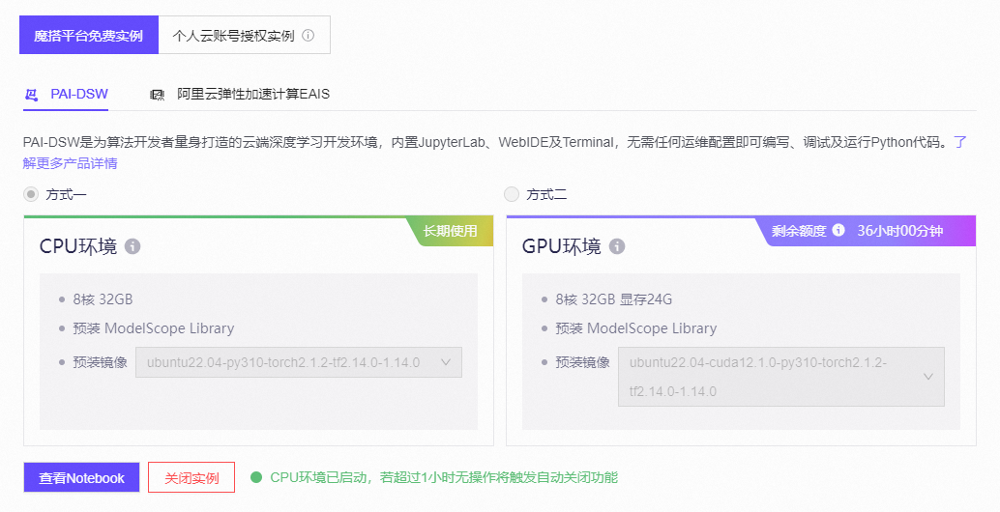

# 常见大语言模型分享比较

## 项目简介

1. 登录并使用魔搭平台，关联阿里云账号来获得免费的CPU云计算资源；

2. 通过Jupyter Notebook进入相应的项目部署环境，完成模型的部署；

3. 针对2-3个不同的模型进行一些应用场景的测试，并开展不同模型之间的横向对比；

**本项目中横向对比的模型是：**

- [通义千问Qwen-7B-Chat](https://www.modelscope.cn/models/qwen/Qwen-7B-Chat/summary)

- [智谱ChatGLM3-6B](https://www.modelscope.cn/models/ZhipuAI/chatglm3-6b/summary)

**应用场景样例**

- "请说出以下两句话区别在哪里？1 、冬天：能穿多少穿多少。2、夏天：能穿多少穿多少。"

- "什么是马尔可夫决策过程？"

- "请介绍欧拉定理。"

- "在一个五人小组中，分别叫 A、B、C、D、E，他们都要参加一个面试，并排成一行就坐。你知道以下事实：A 不坐在最左边，也不坐在最右边。B 坐在 A 的右边，但不紧挨着。C 不坐在中间位置。D 坐在 C 的旁边。E 坐在最右边。请说明五人的座位顺序。"

- "使用C++代码编写程序：给定一个只包含正整数的数组 nums，判断是否可以将这个数组分割成两个子集，使得两个子集的元素和相等。"

## 配置流程

### 配置云服务器

* 在[魔搭社区](https://www.modelscope.cn)启动 PAI-DSW CPU 环境


### 环境搭建

* 下载 `conda` ，解压后将 `conda` 加入到环境变量中

   ```bash
  wget https://repo.anaconda.com/miniconda/Miniconda3-latest-Linux-x86_64.sh
  bash Miniconda3-latest-Linux-x86_64.sh -b -p /opt/conda
  echo 'export PATH="/opt/conda/bin:$PATH"' >> ~/.bashrc
  source ~/.bashrc
  ```

* 查看 `conda` 版本，验证 `conda` 配置成功

  ```bash
  conda --version
  ```

* `conda` 配置成功后，创建并激活环境，`virtual` 为对环境的命名

  ```bash
  conda create -n virtual python=3.10 -y
  source /opt/conda/etc/profile.d/conda.sh
  conda activate virtual
  ```

### 安装基础依赖

* 在安装前执行以下命令检查 `pip` 是否能正常联网
  
  ```bash
  pip install -U pip setuptools wheel
  ```

* 安装 `PyTorch` CPU 版本

  ```bash
  pip install \
  torch==2.3.0+cpu \
  torchvision==0.18.0+cpu \
  --index-url https://download.pytorch.org/whl/cpu
  ```

* 安装 `Transformers` 等依赖

  ```bash
  pip install \
  "intel-extension-for-transformers==1.4.2" \
  "neural-compressor==2.5" \
  "transformers==4.33.3" \
  "modelscope==1.9.5" \
  "pydantic==1.10.13" \
  "sentencepiece" \
  "tiktoken" \
  "einops" \
  "transformers_stream_generator" \
  "uvicorn" \
  "fastapi" \
  "yacs" \
  "setuptools_scm"
  ```

* 安装 `fschat`

  ```bash
  pip install fschat --use-pep517
  ```

## 大语言模型下载

* 切换至工作目录

  ```bash
  cd /mnt/workspace
  ```

* 按照需求下载相对应的中文大模型至本地

  ```bash
  git clone <目标模型网络地址>
  # 例如
  git clone https://www.modelscope.cn/ZhipuAI/chatglm3-6b.git
  git clone https://www.modelscope.cn/qwen/Qwen-7B-Chat.git
  ```

## 大语言模型运行

* 编写运行脚本
 
  ```python
  from transformers import TextStreamer, AutoTokenizer, AutoModelForCausalLM
  model_name = "<你的模型路径>"
  prompt = "<你的问题>"
  tokenizer = AutoTokenizer.from_pretrained(
      model_name,
      trust_remote_code=True
  )
  model = AutoModelForCausalLM.from_pretrained(
      model_name,
      trust_remote_code=True,
      torch_dtype="auto"
  ).eval()
  inputs = tokenizer(prompt, return_tensors="pt").input_ids
  streamer = TextStreamer(tokenizer)
  outputs = model.generate(inputs, streamer=streamer, max_new_tokens=300)
  ```

* 在终端运行脚本，即可查看模型回答

  ```bash
  python <脚本名称>
  ```