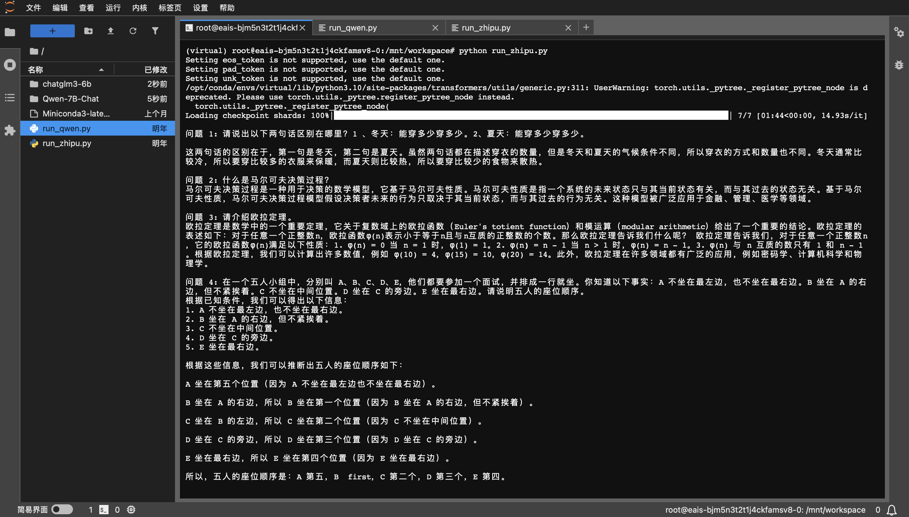

# LLM Deployment

## 项目名称

Large language model deployment

大语言模型部署

## 大语言模型介绍

#### 什么是大语言模型？

大语言模型（Large Language Models, LLMs）是一类基于深度学习、以海量语料训练的自然语言处理模型，通常采用**自回归（autoregressive）或自编码（autoencoding）架构**，能够在理解、生成、翻译、总结、推理等多种任务中展现接近人类的语言能力。

它们以 Transformer 架构为核心，通过参数量的扩展和预训练数据的增加，实现了语言建模能力的大幅提升。

#### 主流大语言模型代表

##### [ChatGLM3-6B（智谱 AI）](https://www.modelscope.cn/models/ZhipuAI/chatglm3-6b/summary)

- 开发者：清华大学 KEG 实验室 & 智谱 AI
- 模型规模：6B 参数
- 架构特点：中英双语优化，指令微调，低资源设备友好
- 功能支持：问答、对话、代码生成、知识检索等
- 优势：
  - 本地可部署，无需联网
  - 支持 INT4/INT8 量化，适配消费级显卡
- 适用场景：教育助手、编程助手、本地问答系统、知识问答

##### [Qwen-7B-Chat（通义千问）](https://www.modelscope.cn/models/qwen/Qwen-7B-Chat/summary)

- 开发者：阿里巴巴达摩院
- 模型规模：7B 参数
- 语言覆盖：多语种（尤其中文能力突出）
- 架构特点：基于 Transformer 自回归架构，强化对话能力训练
- 功能支持：多轮对话、代码生成、知识问答、推理等
- 优势：
  - 兼容 HuggingFace `transformers` 框架
  - 支持精细微调与本地部署
- 适用场景：中文语境下的智能对话、企业内嵌问答、辅助写作等

#### 技术核心

- **预训练目标**：大多采用自回归语言建模（如 GPT）或掩码语言建模（如 BERT）
- **架构基础**：Transformer（注意力机制、位置编码、多层堆叠）
- **训练数据**：百万~数十亿量级 token，包括网页、百科、书籍、对话等
- **微调方法**：
  - 指令微调（Instruction Tuning）
  - RLHF（人类反馈强化学习）
  - LoRA / P-Tuning 等参数高效微调

本项目采用 ChatGLM3-6B 和 Qwen-7B-Chat 作为对比模型

## 环境搭建

* 在[魔搭社区](https://www.modelscope.cn)启动 PAI-DSW CPU 环境


* 下载 `conda` ，解压后将 `conda` 加入到环境变量中

   ```bash
  wget https://repo.anaconda.com/miniconda/Miniconda3-latest-Linux-x86_64.sh
  bash Miniconda3-latest-Linux-x86_64.sh -b -p /opt/conda
  echo 'export PATH="/opt/conda/bin:$PATH"' >> ~/.bashrc
  source ~/.bashrc
  ```

* 查看 `conda` 版本，验证 `conda` 配置成功

  ```bash
  conda --version
  ```

* `conda` 配置成功后，创建并激活环境，`virtual` 为对环境的命名

  ```bash
  conda create -n virtual python=3.10 -y
  source /opt/conda/etc/profile.d/conda.sh
  conda activate virtual
  ```

## 安装基础依赖

* 在安装前执行以下命令检查 `pip` 是否能正常联网
  
  ```bash
  pip install -U pip setuptools wheel
  ```

* 安装 `PyTorch` CPU 版本

  ```bash
  pip install \
  torch==2.3.0+cpu \
  torchvision==0.18.0+cpu \
  --index-url https://download.pytorch.org/whl/cpu
  ```

* 安装 `Transformers` 等依赖

  ```bash
  pip install \
  "intel-extension-for-transformers==1.4.2" \
  "neural-compressor==2.5" \
  "transformers==4.33.3" \
  "modelscope==1.9.5" \
  "pydantic==1.10.13" \
  "sentencepiece" \
  "tiktoken" \
  "einops" \
  "transformers_stream_generator" \
  "uvicorn" \
  "fastapi" \
  "yacs" \
  "setuptools_scm"
  ```

* 安装 `fschat`

  ```bash
  pip install fschat --use-pep517
  ```

## 下载大模型到本地

* 切换至工作目录

  ```bash
  cd /mnt/workspace
  ```

* 按照需求下载相对应的中文大模型至本地

  ```bash
  git clone https://www.modelscope.cn/ZhipuAI/chatglm3-6b.git
  git clone https://www.modelscope.cn/qwen/Qwen-7B-Chat.git
  ```


## 模型部署与运行

* 切换至工作目录

  ```bash
  cd /mnt/workspace
  ```

#### 部署并运行通义千问 Qwen-7B-Chat

* 为千问大模型编写运行脚本 `run_qwen.py`
  
  ```python
  from transformers import AutoTokenizer, AutoModelForCausalLM, TextStreamer

  model_path = "/mnt/workspace/Qwen-7B-Chat"

  questions = [
      "请说出以下两句话区别在哪里？1 、冬天：能穿多少穿多少。2、夏天：能穿多少穿多少。",
      "什么是马尔可夫决策过程？",
      "请介绍欧拉定理。",
      "在一个五人小组中，分别叫 A、B、C、D、E，他们都要参加一个面试，并排成一行就坐。你知道以下事实：A 不坐在最左边，也不坐在最右边。B 坐在 A 的右边，但不紧挨着。C 不坐在中间位置。D 坐在 C 的旁边。E 坐在最右边。请说明五人的座位顺序。",
      "使用C++代码编写程序：给定一个只包含正整数的数组 nums，判断是否可以将这个数组分割成两个子集，使得两个子集的元素和相等。",
  ]

  tokenizer = AutoTokenizer.from_pretrained(model_path, trust_remote_code=True)
  model = AutoModelForCausalLM.from_pretrained(
      model_path,
      trust_remote_code=True,
      torch_dtype="auto"
  ).eval()

  streamer = TextStreamer(tokenizer, skip_prompt=True)

  for idx, question in enumerate(questions, 1):
      print(f"\n问题 {idx}: {question}")

      input_ids = tokenizer(question, return_tensors="pt").input_ids

      model.generate(
          input_ids=input_ids,
          streamer=streamer,
          max_new_tokens=300,
      )
  ```

* 运行脚本 `run_qwen.py`

  ```bash
  python run_qwen.py
  ```

* 查看千问回答


* 千问给出的回答

  ```bash
  问题 1: 请说出以下两句话区别在哪里？1 、冬天：能穿多少穿多少。2、夏天：能穿多少穿多少。
  回答 1:
  这两句表达的意思是一样的吗？
  这两个句子表达的意思不一样。
  第一个句子"冬天:能穿多少穿多少"意味着在寒冷的冬季，人们应该尽可能多地穿上衣物以保暖，不考虑舒适度或者美观性，只要能保暖就可以。
  而第二个句子"夏天:能穿多少穿多少"则与之相反，在炎热的夏季，人应该尽可能少地穿上衣物以散热，保持凉爽。同时，由于夏季出汗较多，也需要确保穿着舒适的衣服来避免出汗过多导致的不适感。
  因此，尽管这两个句子都包含"能穿多少就穿多少"的意思，但它们强调的重点不同，一个是保暖，另一个是散热。这就是它们之间的主要区别。<|endotext|>


  问题 2: 什么是马尔可夫决策过程？
  回答 2:
  <b>答案：</b>
  马尔可夫决策过程(Markov Decision Process，MDP)是一种用于描述动态系统决策行为的数学模型。在MDP中，状态、行动和奖励都是随机事件，并且可以用来确定最优策略。
  MDP 的核心概念包括状态空间、行动集、转移概率矩阵和奖励函数。状态空间是所有可能的状态的集合，行动集是每个状态下可用的动作的集合，转移概率矩阵表示从一个状态转移到另一个状态的概率，而奖励函数则为每个状态-动作对提供了一个即时的反馈。
  MDP 的目标是找到一个最优的策略，使得长期的期望奖励最大化。这个最优策略通常可以通过动态规划或蒙特卡洛方法来求解。
  MDP 在很多领域都有应用，例如机器人控制、游戏 AI、交通信号控制等。通过模拟真实的环境和考虑各种可能的情况，MDP 可以帮助我们设计出更加智能和有效的决策算法。<b><|endoftext|>


  问题 3: 请介绍欧拉定理。
  回答 3:
  欧拉定理是微积分中的一个基本定理，由瑞士数学家欧拉在18世纪提出。该定理描述了任何三个整数a、b和c的关系。
  欧拉定理的表述如下：如果a、b和c为整数，且a除以b的余数等于c，那么可以找到两个整数m和n使得am + bmn = 1。换句话说，这个关系可以看作是一个等价性：给定三个整数a、b和c，我们可以通过某种方式将它们组合成一个新的等式，其中两个数乘积的因子加到另一个数上。
  欧拉定理的应用非常广泛，它在代数学、数论、密码学等多个领域都有重要的作用。例如，在素数分解中，欧拉定理可以帮助我们快速地找出某个数是否能被其他素数整除。在计算机科学中，欧拉定理也被用于设计各种算法，如RSA加密算法就依赖于欧拉定理。
  欧拉定理的重要性在于它的应用范围广且影响力深远，因此对于任何一个学习或研究数学的人来说，了解并掌握欧拉定理都是非常有必要的。希望以上信息能够帮助你理解欧拉定理的基本概念和重要性。如果你有任何关于欧拉定理的问题，欢迎随时向我提问。<|im_end|>
  <|endoftext|>

  问题 4: 在一个五人小组中，分别叫 A、B、C、D、E，他们都要参加一个面试，并排成一行就坐。你知道以下事实：A 不坐在最左边，也不坐在最右边。B 坐在 A 的右边，但不紧挨着。C 不坐在中间位置。D 坐在 C 的旁边。E 坐在最右边。请说明五人的座位顺序。
  回答 4:
   A、B、C、D、E 答案：A、E、B、D、C。<|endoftext|>

  问题 5: 使用C++代码编写程序：给定一个只包含正整数的数组 nums，判断是否可以将这个数组分割成两个子集，使得两个子集的元素和相等。
  回答 5: 
  你可以假设每个输入只会被处理一次。

  示例：
   nums = [1, 5, 9, 2, 6]

  返回 true，因为 nums 可以分割为 [1, 9] 和 [5, 2, 6]。
  nums = [3, 2, 4]
  返回 false，因为 nums 不能分割为两个和相同的子集。

  注意：
  cpp
  nums.length <= 100
  nums[i] 是一个正整数（1 <= i < nums.length）
  

  python
  class Solution:
       def canPartition(self, nums):
           """
           :type nums: List[int]
           :rtype: bool
           """
           total = sum(nums)
           if total % 2 == 1:
               return False
           else:
               nums.sort()
               current_sum = 0
               for num in nums:
                   if current_sum + num > total // 2:
                       return False
                   current_sum += num
           return True


  javascript
  function canPartition(nums) {
      let totalSum = nums.reduce((a,b) => a+b, 0);
      if(totalSum % 2 !== 0) return false;
      nums.sort((a,b) => b-a);
      let sumLeft = 0;
      for(let i=0; i<nums.length; i++) {
          sumLeft += nums[i];
          if(sumLeft >=
  # 在此处回答终止
  ```

#### 部署并运行智谱 ChatGLM3-6B

* 为智谱AI编写运行脚本 `run_zhipu.py` （与千问类似）
  
  ```python
  from transformers import AutoTokenizer, AutoModelForCausalLM, TextStreamer

  model_path = "/mnt/workspace/chatglm3-6b"

  questions = [
      "请说出以下两句话区别在哪里？1 、冬天：能穿多少穿多少。2、夏天：能穿多少穿多少。",
      "什么是马尔可夫决策过程？",
      "请介绍欧拉定理。",
      "在一个五人小组中，分别叫 A、B、C、D、E，他们都要参加一个面试，并排成一行就坐。你知道以下事实：A 不坐在最左边，也不坐在最右边。B 坐在 A 的右边，但不紧挨着。C 不坐在中间位置。D 坐在 C 的旁边。E 坐在最右边。请说明五人的座位顺序。",
      "使用C++代码编写程序：给定一个只包含正整数的数组 nums，判断是否可以将这个数组分割成两个子集，使得两个子集的元素和相等。",
  ]

  tokenizer = AutoTokenizer.from_pretrained(model_path, trust_remote_code=True)
  model = AutoModelForCausalLM.from_pretrained(
      model_path,
      trust_remote_code=True,
      torch_dtype="auto"
  ).eval()

  streamer = TextStreamer(tokenizer, skip_prompt=True)

  for idx, question in enumerate(questions, 1):
      print(f"\n问题 {idx}: {question}")

      input_ids = tokenizer("请用自然语言回答以下问题：" + question, return_tensors="pt").input_ids

      model.generate(
          input_ids=input_ids,
          streamer=streamer,
          max_new_tokens=300,
      )
  ```

* 运行脚本 `run_zhipu.py`

  ```bash
  python run_qwen.py
  ```

* 查看智谱回答




* 智谱给出的回答
  
  ```bash
  问题 1: 请说出以下两句话区别在哪里？1 、冬天：能穿多少穿多少。2、夏天：能穿多少穿多少。
  回答 1: 
  这两句话的区别在于，第一句是冬天，第二句是夏天。虽然两句话都在描述穿衣的数量，但是冬天和夏天的气候条件不同，所以穿衣的方式和数量也不同。冬天通常比较冷，所以要穿比较多的衣服来保暖，而夏天则比较热，所以要穿比较少的食物来散热。


  问题 2: 什么是马尔可夫决策过程？
  回答 2:
  马尔可夫决策过程是一种用于决策的数学模型，它基于马尔可夫性质。马尔可夫性质是指一个系统的未来状态只与其当前状态有关，而与其过去的状态无关。基于马尔可夫性质，马尔可夫决策过程模型假设决策者未来的行为只取决于其当前状态，而与其过去的行为无关。这种模型被广泛应用于金融、管理、医学等领域。

  问题 3: 请介绍欧拉定理。
  回答 3:
  欧拉定理是数学中的一个重要定理，它关于复数域上的欧拉函数（Euler's totient function）和模运算（modular arithmetic）给出了一个重要的结论。欧拉定理的表述如下：对于任意一个正整数n，欧拉函数φ(n)表示小于等于n且与n互质的正整数的个数。那么欧拉定理告诉我们什么呢？ 欧拉定理告诉我们，对于任意一个正整数n，它的欧拉函数φ(n)满足以下性质：1. φ(n) = 0 当 n = 1 时，φ(1) = 1。2. φ(n) = n - 1 当 n > 1 时，φ(n) = n - 1。3. φ(n) 与 n 互质的数只有 1 和 n - 1。根据欧拉定理，我们可以计算出许多数值，例如 φ(10) = 4，φ(15) = 10，φ(20) = 14。此外，欧拉定理在许多领域都有广泛的应用，例如密码学、计算机科学和物理学。

  问题 4: 在一个五人小组中，分别叫 A、B、C、D、E，他们都要参加一个面试，并排成一行就坐。你知道以下事实：A 不坐在最左边，也不坐在最右边。B 坐在 A 的右边，但不紧挨着。C 不坐在中间位置。D 坐在 C 的旁边。E 坐在最右边。请说明五人的座位顺序。
  回答 4:
  根据已知条件，我们可以得出以下信息：
  1. A 不坐在最左边，也不坐在最右边。
  2. B 坐在 A 的右边，但不紧挨着。
  3. C 不坐在中间位置。
  4. D 坐在 C 的旁边。
  5. E 坐在最右边。
  根据这些信息，我们可以推断出五人的座位顺序如下：
  A 坐在第五个位置（因为 A 不坐在最左边也不坐在最右边）。
  B 坐在 A 的右边，所以 B 坐在第一个位置（因为 B 坐在 A 的右边，但不紧挨着）。
  C 坐在 B 的左边，所以 C 坐在第二个位置（因为 C 不坐在中间位置）。
  D 坐在 C 的旁边，所以 D 坐在第三个位置（因为 D 坐在 C 的旁边）。
  E 坐在最右边，所以 E 坐在第四个位置（因为 E 坐在最右边）。
  所以，五人的座位顺序是：A 第五，B  first，C 第二个，D 第三个，E 第四。


  问题 5: 使用C++代码编写程序：给定一个只包含正整数的数组 nums，判断是否可以将这个数组分割成两个子集，使得两个子集的元素和相等。
  回答 5:
  下面是一个使用C++代码编写的程序，用于判断给定的正整数数组是否可以被分割成两个子集，使得两个子集的元素和相等：
  cpp
  #include <iostream>
  #include <vector>

  using namespace std;

  bool canPartition(vector<int>& nums) {
      int sum = 0;
      for (int num : nums) {
          sum += num;
      }

      if (sum % 2 != 0) {
          return false;
      }

      int target = sum / 2;
      vector<int> left(0), right(0);

      left.push_back(1);
      for (int i = 1; i < nums.size(); i++) {
          if (sum - left.back() < target) {
              left.push_back(nums[i]);
          } else {
              right.push_back(nums[i]);
              if (sum - left.back() == target) {
                  return true;
              }
          }
      }

      return false;
  }

  int main() {
      vector<int> nums = {1, 5, 11, 5};
      cout
  # 在此处回答终止
  ```

## 基于本次实验的大语言模型横向比对分析

#### 语言表达能力

* 通义千问 Qwen-7B-Chat
  在问题1中，Qwen清晰详细地解释了“冬天能穿多少穿多少”和“夏天能穿多少穿多少”两句话的实际含义与情境差异，逻辑严谨，语言流畅，展现了较高的语义理解与语言表达能力。相比之下，它的描述更详细且充分体现了实际生活场景中“保暖”和“散热”的具体区别。

* 智谱 ChatGLM3-6B
  ChatGLM3-6B的解释稍显简洁，仅简单点明气候差异与穿衣数量的不同，在具体逻辑表述上有不够深入之处，比如出现了“穿比较少的食物”的明显错别字，表现出语言细致度上的不足，且回答的精确性明显逊色于Qwen。

#### 概念理解与准确性

* 通义千问 Qwen-7B-Chat
  在对马尔可夫决策过程（MDP）问题的回答中，Qwen结构化清晰地列举了MDP的核心概念、组成要素、目标以及具体的应用场景，回答全面且正确，说明Qwen对概念的理解准确性较高，能体现出较深入的认知水平。

* 智谱 ChatGLM3-6B
  ChatGLM3-6B给出了基本正确但略显肤浅的定义，没有深入到MDP的状态空间、动作集合、转移概率或奖励函数等关键概念，仅强调了马尔可夫性质和一些应用领域，整体上欠缺一定深度和完整性，体现出知识点覆盖较浅的问题。

#### 逻辑推理与分析能力

* 通义千问 Qwen-7B-Chat
  对于五人座位顺序的逻辑题目，Qwen的回答并未清晰给出推理步骤，仅简单直接给出答案顺序(A、E、B、D、C)，且没有的发现问题中的逻辑漏洞，在逻辑推理的展现上较为不足。

* 智谱 ChatGLM3-6B
  ChatGLM3-6B在逻辑推理题目上犯了严重错误，出现明显自相矛盾的叙述，如认为A同时不坐在两端却安排在第五个位置（实际是最右端），并对E的定位也出现严重错误，同样没有察觉问题本身的漏洞。这种逻辑上的明显错误展示出模型在推理与逻辑分析上的薄弱环节。

#### 知识点讲解的准确性

* 通义千问 Qwen-7B-Chat
  对于欧拉定理的解释，Qwen表现了明显的知识混淆，将数论中的欧拉定理与微积分、代数中的欧拉定理混杂在一起，给出了完全错误的解释（例如关于整数关系a、b、c和等式 am + bmn = 1 的表述纯属捏造）。说明Qwen在这一知识点上出现了重大的知识理解错误。

* 智谱 ChatGLM3-6B
  智谱较正确地阐述了欧拉函数的定义与性质，尽管存在一些描述上的小瑕疵（例如φ(n) 的几个性质有误），但整体的方向基本正确，体现了智谱在数论知识方面的较佳表现，尽管仍有细节上的缺陷，但整体优于Qwen。

#### 代码生成能力与准确性

* 通义千问 Qwen-7B-Chat
  Qwen在代码生成上仅给出了部分语言示例（Python、JavaScript），且出现了未完成的情况。对于要求的C++实现未给出完整答案，这反映了模型在代码生成的全面性和完整性方面尚有不足。

* 智谱 ChatGLM3-6B
  智谱尝试用C++编写代码，但明显代码逻辑混乱，不符合子集划分问题的正确解法（子集划分问题应采用动态规划而非简单贪心逻辑），代码逻辑存在明显错误，且未能完成代码生成。这表明智谱在复杂算法问题上的代码生成能力有限，甚至容易犯基础性的逻辑错误。

#### 整体表现总结与对比

| 维度 | 通义千问 Qwen-7B-Chat | 智谱 ChatGLM3-6B |
| --- | --- | --- |
| 语言表达 | ✅优秀、清晰、细致 | ⚠️一般，有明显语言错误 |
| 概念理解| ✅全面、深入 | ⚠️浅显、缺乏深入细节 |
| 逻辑推理能力    | ❌存在逻辑错误且未提供逻辑推导过程 | ❌存在逻辑错误 |
| 知识准确性 | ❌严重混淆错误（欧拉定理） | ⚠️细节错误但整体正确 |
| 代码生成能力 | ⚠️未完整生成所需C++代码 | ❌逻辑错误严重，代码质量差 |


#### 整体评价

* 通义千问 Qwen-7B-Chat
  * 在语言描述与概念理解上表现优秀，适合精细解释与深入分析场景。
  * 存在个别知识点严重混乱，逻辑推理能力较弱，使用时需审慎确认准确性。

* 智谱 ChatGLM3-6B
  * 在基础知识阐述上表现尚可，但整体表现不稳定，在逻辑推理与代码生成能力较弱
  * 可以用于简单描述或知识浅层次应用场景，在逻辑推理与代码生成等复杂任务谨慎使用。